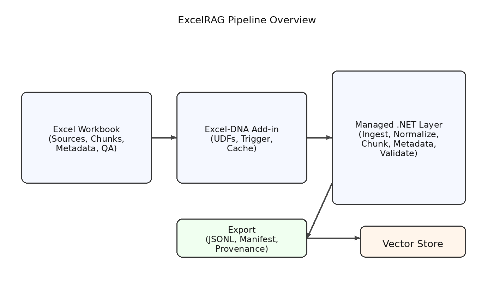

# ExcelRAG

> **Turn Excel into a first-class workspace for preparing Retrieval-Augmented Generation (RAG) data — natively, transparently, and at scale.**

---

## Vision

<p align="center">
  
  <br/>
  <em>Excel as a visual, auditable RAG preparation pipeline</em>
</p>

**ExcelRAG** is an Excel-DNA add-in that transforms Excel into a powerful, trustworthy workspace for preparing data used in RAG pipelines. It brings modern data prep and knowledge-curation workflows into Excel while keeping the experience formula-driven, transparent, and fully inspectable.

The guiding idea:

> *If someone already trusts Excel to prepare business data, they should be able to prepare RAG-ready knowledge with the same mental model.*

ExcelRAG is **not** a production RAG engine. It is a **data preparation, governance, and export layer** built for:

* structured content ingestion
* chunking and normalization
* metadata enrichment
* quality checks and audits
* vector-ready export packages

---

## Why Excel for RAG?

Excel already excels at:

* tabular structure and auditability
* formulas for transformation and enrichment
* versioned snapshots of curated knowledge
* collaborative review and approval
* quick visualization and QA checks

What it lacks is RAG-specific tooling:

* document ingestion and parsing
* chunking strategies
* metadata extraction
* deduplication and similarity checks
* vector packaging and export

ExcelRAG fills that gap using **Excel-native UDFs** and a small, explicit processing engine behind the scenes.

---

## Core Design Principles

### 1) Excel remains Excel

* No VBA macros
* No external Python runtime
* No opaque background automation

Every capability is exposed as **deterministic Excel functions** that are visible, reviewable, and easy to test.

---

### 2) Explicit, user-controlled processing

ExcelRAG avoids surprise side effects by requiring a user-controlled **trigger** for any operation that mutates state or performs heavy processing.

```excel
=RAG.INGEST(source, options, trigger)
=RAG.CHUNK(content, strategy, options, trigger)
```

This matches Excel’s recalculation model and keeps data prep deliberate and auditable.

---

### 3) Inspectable, cell-level transparency

Every step produces tangible, inspectable outputs in the grid:

* parsed text and tables
* chunk boundaries
* metadata fields
* token counts
* validation warnings

If it can be used for RAG, it can be **seen and verified** in Excel.

---

### 4) RAG-first data quality

ExcelRAG is designed for **clean, consistent, and richly annotated** content. It prioritizes:

* normalization
* traceability to source
* metadata completeness
* data provenance
* export-ready structure

---

## RAG Workflow Support

ExcelRAG supports a typical RAG preparation lifecycle:

1. **Ingest**
   * PDFs, DOCX, HTML, Markdown, CSV, URLs
   * Text extraction with source metadata

2. **Normalize & Clean**
   * whitespace and formatting normalization
   * boilerplate removal
   * table flattening

3. **Chunk**
   * sentence-aware or token-based chunking
   * overlap control
   * section-aware chunking for headings

4. **Enrich Metadata**
   * document titles and sections
   * author/owner fields
   * business tags
   * PII flags or sensitivity levels

5. **Quality Checks**
   * duplicate detection
   * minimum/maximum token constraints
   * missing metadata checks
   * hallucination risk flags (e.g., low coverage)

6. **Package & Export**
   * vector-store friendly JSONL
   * embeddings-ready manifests
   * provenance maps

---

## Key Features (Planned Add-in Functions)

### Ingestion & Parsing

* `RAG.INGEST` — import files or URLs with parsing options
* `RAG.EXTRACT_TEXT` — extract text from common document formats
* `RAG.EXTRACT_TABLES` — flatten tables to text or structured ranges

### Chunking & Structuring

* `RAG.CHUNK` — generate chunk lists using strategies (sentence, token, heading)
* `RAG.CHUNK_STATS` — token counts, overlap metrics, and coverage
* `RAG.SECTIONS` — parse headings and structure long docs

### Metadata & Enrichment

* `RAG.METADATA` — create consistent metadata records
* `RAG.TAG` — generate or validate tags against a taxonomy
* `RAG.PROVENANCE` — map chunks back to source offsets

### Quality & Governance

* `RAG.DEDUP` — detect duplicate or near-duplicate chunks
* `RAG.VALIDATE` — rule-based data quality checks
* `RAG.RISK_FLAGS` — highlight content risk or low-coverage areas

### Export & Packaging

* `RAG.EXPORT_JSONL` — produce vector-ready export files
* `RAG.EXPORT_MANIFEST` — embeddings manifests with metadata and source links
* `RAG.EXPORT_TRACE` — end-to-end traceability for governance

---

## Ribbon (Planned UI)

ExcelRAG includes a dedicated **RAG** ribbon tab for guided workflows and governance-friendly actions. The ribbon complements UDFs by providing quick actions, templates, and validation panels without hiding any outputs from the worksheet.

**Tab: RAG**

* **Ingest**
   * Import Files (PDF, DOCX, HTML, MD)
   * Import URL
   * Manage Sources

* **Normalize**
   * Clean Text
   * Remove Boilerplate
   * Flatten Tables

* **Chunk**
   * Sentence-Aware Chunking
   * Token-Based Chunking
   * Preview Chunk Boundaries

* **Metadata**
   * Apply Metadata Template
   * Tag Validation
   * Provenance Mapping

* **Quality**
   * Duplicate Scan
   * Coverage Check
   * Missing Metadata Report

* **Export**
   * Export JSONL
   * Export Manifest
   * Open Export Folder

* **Diagnostics**
   * Processing Log
   * Cache Inspector
   * Settings

The ribbon actions generate or refresh **worksheet tables** so every step remains visible and reviewable.

---

## Example Dataset and UDF Effects

Below is a small example dataset representing three source documents in a worksheet table.

**Input: Sources**

| SourceId | Title | Content | Owner | Tags |
| --- | --- | --- | --- | --- |
| DOC-001 | Employee Onboarding | Welcome to Contoso. New hires must complete security training within 10 business days. | HR | onboarding;policy |
| DOC-002 | VPN Access | VPN access is required for remote work. Submit the VPN request form and complete MFA setup. | IT | security;remote |
| DOC-003 | Expense Policy | Receipts are required for expenses over $25. Mileage is reimbursed at $0.67 per mile. | Finance | policy;travel |

**Effect: RAG.CHUNK** (sentence-aware, max 40 tokens, overlap 8)

| ChunkId | SourceId | ChunkText | TokenCount | OffsetStart | OffsetEnd |
| --- | --- | --- | --- | --- | --- |
| CH-0001 | DOC-001 | Welcome to Contoso. New hires must complete security training within 10 business days. | 20 | 0 | 97 |
| CH-0002 | DOC-002 | VPN access is required for remote work. Submit the VPN request form and complete MFA setup. | 23 | 0 | 101 |
| CH-0003 | DOC-003 | Receipts are required for expenses over $25. Mileage is reimbursed at $0.67 per mile. | 22 | 0 | 99 |

**Effect: RAG.METADATA** (template with SourceId, Title, Owner, Tags, Section=General)

| ChunkId | SourceId | Title | Owner | Tags | Section |
| --- | --- | --- | --- | --- | --- |
| CH-0001 | DOC-001 | Employee Onboarding | HR | onboarding;policy | General |
| CH-0002 | DOC-002 | VPN Access | IT | security;remote | General |
| CH-0003 | DOC-003 | Expense Policy | Finance | policy;travel | General |

**Effect: RAG.DEDUP** (near-duplicate scan, threshold 0.92)

| ChunkId | DuplicateGroup | Similarity | Status |
| --- | --- | --- | --- |
| CH-0001 | G-01 | 0.18 | Unique |
| CH-0002 | G-02 | 0.22 | Unique |
| CH-0003 | G-03 | 0.20 | Unique |

**Effect: RAG.VALIDATE** (rules: minTokens=10, maxTokens=250, tagsRequired=true)

| ChunkId | Rule | Result | Notes |
| --- | --- | --- | --- |
| CH-0001 | TagsRequired | Pass | Tags present |
| CH-0001 | TokenRange | Pass | 20 tokens |
| CH-0002 | TagsRequired | Pass | Tags present |
| CH-0002 | TokenRange | Pass | 23 tokens |
| CH-0003 | TagsRequired | Pass | Tags present |
| CH-0003 | TokenRange | Pass | 22 tokens |

These tables are meant to illustrate what appears directly in Excel as outputs of key UDFs, enabling quick review before export.

---

## Architecture Overview

```
Excel
 ├─ Worksheets (tables, named ranges, checks)
 ├─ UDFs (RAG.INGEST, RAG.CHUNK, ...)
 │
Excel-DNA Add-in (.xll)
 ├─ Async-safe UDF execution
 ├─ Trigger-aware processing
 ├─ Local cache & registry
 │
Managed .NET Layer
 ├─ Parsing, chunking, metadata
 ├─ Content normalization
 ├─ Validation rules engine
 │
Export Layer
 ├─ JSONL, manifest, provenance
 └─ Vector-store ready packages
```

All logic runs **in-process** with Excel for visibility and speed, while keeping data in the workbook for auditability.

---

## Intended Audience

ExcelRAG is for:

* analysts curating enterprise knowledge
* teams preparing documents for search and RAG
* compliance-minded organizations
* Excel power users who want a transparent, reviewable pipeline

It is **not** for:

* full-scale production inference
* large-scale embedding compute
* real-time RAG orchestration

---

## Status

This project is **experimental and exploratory**.

The goal is to answer one question:

> *What would RAG data preparation look like if it were designed for transparency and governance first?*

---

## See Also

* `ExcelDNA_Best_Practices_and_Architectural_Patterns_2026.md`
* `ExcelDlPlayground/README.md`

---
